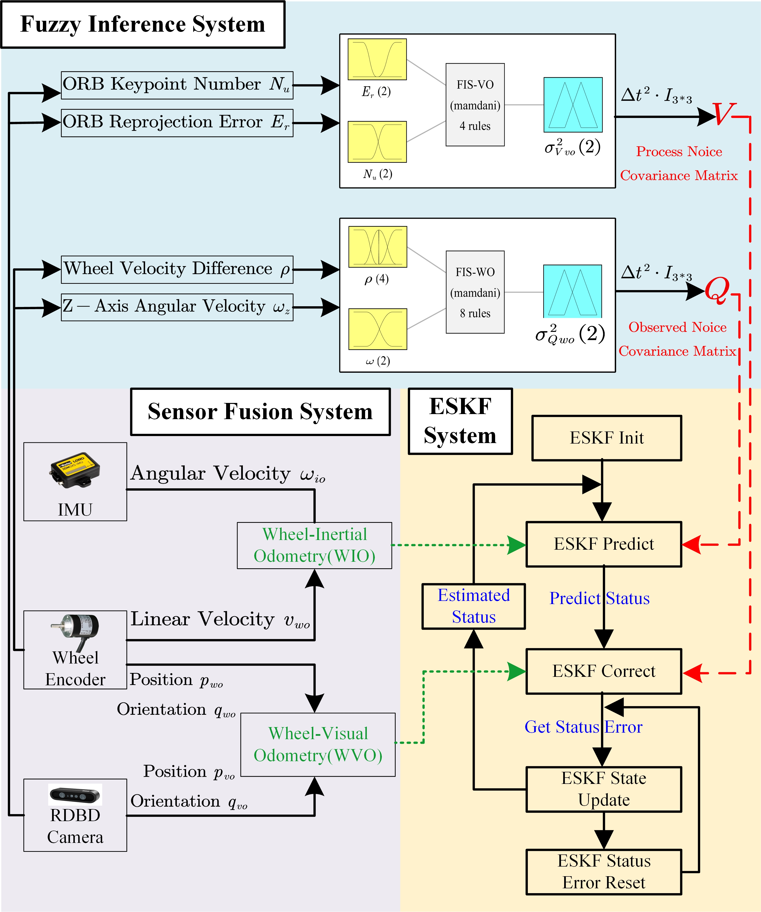
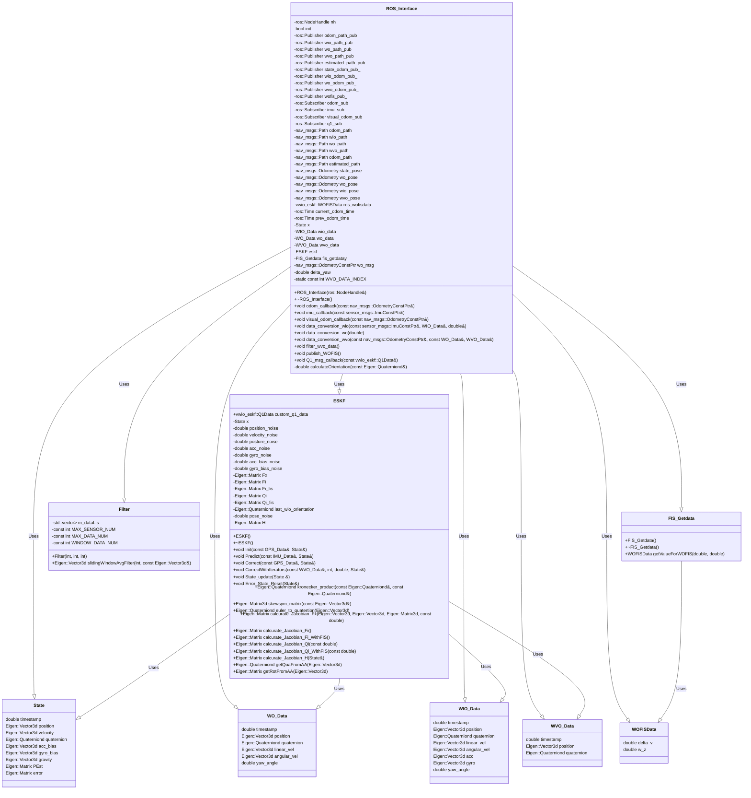

# vwio_eskf
ROS1 Package Using ESKF/IESKF Method for Muti-Sensor Fusion(Wheel Odometry, Inertial Odometry, Visual Odometry)
## Overview
### System Structure Diagram With FIS

### Functionality completed
- [x] Construst **Wheel-Inertial Odometry** (WIO).
- [x] Construst **Wheel-Visual Odometry** (WVO).
- [x] Wheel-Inertial Odometry (WIO) and Wheel-Visual Odometry (WVO) Fusion Localization by **ESKF/IESKF method**.
- [x] Construct **Wheel Odometry Fuzzy Inference System**(WOFIS) with another ROS Package [fis_wo](https://github.com/botlowhao/fis_wo).
  - [x] Custom define ROS data type(vwio_eskf::WOFISData) to send **ros_wofisdata**(including Wheel Velocity Difference and Z-Axies Angular Velocity) by robot's linear and angular velocity.
  - [x] Custom define ROS data type(vwio_eskf::Q1Data) to receive **custom_q1_data** which is used to adjust the Process Covariance Matrix dynamically.
### Functionality to be completed
- [ ] Construct **Visual Odometry Fuzzy Inference System** by Number of Feature Points and Reprojection Error from ORB features.

## Develop Environment
OS:
- Ubuntu 20.04 with NVIDIA Jeston Origin Nano(8GB RAM)
- Ubuntu 20.04 with PC(Intel Core i5 8th Gen, 8GB RAM)

ROS:
- noetic

3rdParty:
- [Eigen 3.3.7](https://gitlab.com/libeigen/eigen/-/archive/3.3.7/eigen-3.3.7.tar.gz)
```
mkdir -p ~/3rdParty
cd ~/3rdParty
git clone https://gitlab.com/libeigen/eigen/-/archive/3.3.7/eigen-3.3.7.tar.gz

sudo tar -xzvf eigen-3.3.7.tar.gz
mv eigen-3.3.7 eigen

cd eigen
mkdir build && cd build
cmake ..
sudo make install
sudo cp -r /usr/local/include/eigen3/Eigen /usr/local/include
```
- [Ceres-Solver 2.2.0](https://github.com/ceres-solver/ceres-solver/releases/tag/2.2.0)

```
# Install Ceres-Solver 2.2.0
sudo apt-get update
sudo apt-get install -y libgoogle-glog-dev libgflags-dev libatlas-base-dev
cd 3rdParty
git clone -b 2.2.0 https://github.com/ceres-solver/ceres-solver.git

cd ceres-solver
mkdir build && cd build
cmake ..
make -j4
sudo make install
```

## Input And Output ROS Topics
### Input
- Wheel Odometry messages /wo_sync (nav_msgs/Odometry)
- Inertial Odometry messages /imu_sync (sensor_msgs/Imu)
- Visual Odometry messages /vo_sync (nav_msgs/Odometry)
- q1 data messages /Q1_msg (vwio_eskf::Q1Data)
### Output
- Wheel Odometry Path message /wo_path (nav_msgs/Path)
- Wheel-Inertial Odometry Path message /wio_path (nav_msgs/Path)
- Wheel-Visual Odometry Path message /wvo_path (nav_msgs/Path)
- Estimated Path message /estimated_path (nav_msgs/Path)
- Wheel Odometry message /wo_pose (nav_msgs/Odometry)
- Wheel-Inertial Odometry message /wio_pose (nav_msgs/Odometry)
- Wheel-Visual Odometry message /wvo_pose (nav_msgs/Odometry)
- Estimated Pose message /state_pose (nav_msgs/Odometry)
- WOFIS data message /WOFIS_msg (vwio_eskf::WOFISData)

## Class Diagram



